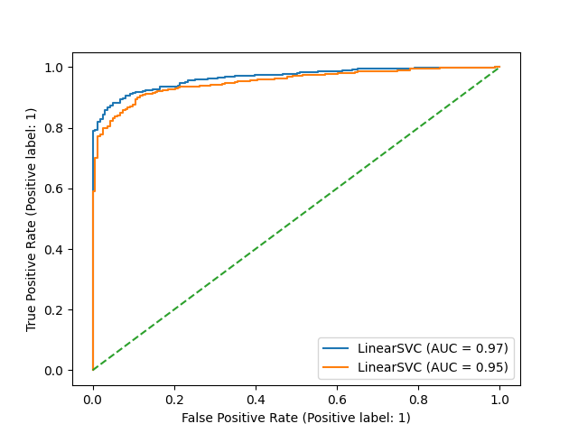

# 2. Ethics

i. Yes it is possible to identify individuals either directly or indirectly from the dataset. If we have another dataset that have the comment style of different indivduals as the feature vector and the name of the individuals as the label, we can train a model that classifies comments. We can then run this dataset through the model and predict which individual made the given comment. <br />
ii. The dataset could be used to train a model that classifies the emotion of a comment based on the style of the comment. It can also be used to train a model that classifies the emotion of a comment based on the time the comment is made. <br />
iii. The dataset shouuld not be used to train a model that predicts the time the coment is made based on the coment style. It also shouldn't be feed into other models that would potentially violate the privacy of commenters, e.x their names, birthdates, gender, or other personal information.<br />

# 3 Feature Extraction

a.<br /> ['best', 'book', 'ever', 'it', 's', 'great'] <br /><br />
b.<br /> d = 4855 <br /><br />
c.<br /> Average number of non-zero features per comment in the training data: 12.241140215716486<br /><br />
    The word appearing in the most number of comments: i

# 4.1 Hyperparameter Selection for a Linear_kernel SVM

a. <br />
By maintaining class proportions across folds, we are minimizing the deviation of folds away from the original training data. This way, the model each fold produces better reflects what a true model would be like if we train on the entire training data. <br /><br />

b.
| Performance Measures 	| C    	| Performance        	|
|----------------------	|------	|--------------------	|
| Accuracy             	| 1.0  	| 0.9210263820957463 	|
| F1-Score             	| 1.0  	| 0.9202149609972474 	|
| AUROC                	| 0.1  	| 0.9723006785314479 	|
| Precision            	| 0.01 	| 0.9980048758644708 	|
| Sensitivity          	| 1.0  	| 0.9106326106326106 	|
| Specificity          	| 1.0  	| 0.9984615384615385 	|

c.
| Performance Measures 	| Performance        	|
|----------------------	|--------------------	|
| Accuracy             	| 0.9199384141647421 	|
| F1-Score             	| 0.9204892966360856 	|
| AUROC                	| 0.978608510133934 	|
| Precision            	| 0.9922027290448343  	|
| Sensitivity          	| 0.9261538461538461 	|
| Specificity          	| 0.9137134052388289 	|

d.<br />


e. <br />


f. <br />
Thank you guys for showing up at my mother's funeral. I am glad to have you as friends. Honestly, I miss her a lot, and it is quite sad that I didn't spend enough time with her. I feel so sorry; it must be disappointing for her.<br />

# 4.2 Linear-Kernel SVM with L1 Penalty and Sqaured Hinge Loss

a. <br />
C value: 1.0 <br />
The mean CV AUROC score: 0.9749627998715654 <br />
AUROC test score: 0.9767618821856111 <br />

b.<br />


c.<br />
We observe that the norms for l2 penalty is much larger than that of l1, meaning that l1 penalty produces a much sparser theta for all C values. The gradient of l1 is constant to each element, meaning that all coefficients are reduced by the same amount so many unimportant features eventually has 0 as their weights to reduce the penalty. If we take the gradient of the minimization expression using l2, we find that it is linear to theta itself. This means that the model can balance the weights of different features and have a more complex parameter vector. 

d. <br />
A squared hinge is forgiving for miscalssified data points that's within the margin comapred to hinge loss. However, it gives more penalty to miscalssified data points. Therefore, the margin will be wider when we use squared hinge loss to reduce the penalty.

# 4.3 Hyperparameter Selection for a Quadatic_Kernel SVM

a.
| Tuning Scheme 	| C                 	| r                  	| AUROC              	|
|---------------	|-------------------	|--------------------	|--------------------	|
| Grid Search   	| 1.0               	| 100.0              	| 0.9769752281616687 	|
| Random Search 	| 41.87830236855281 	| 1.9600598203396193 	| 0.9784520564181582 	|

b. <br />
Generally, if we fix one of C and r and let the other variable vary, the performance curve with respect to the variable always goes up, peaks, and then decays by a bit. As C increases, we will see such curves with absolutely better performance but earlier peaks with respect to r. As r increases, we will also see such curves with absolutely better performance but ealier peaks with respect to C. The pros of grid search would be that we can specify the combination of parameter we want by hard-coding. The cons is that if we have multiple parameters, this process becomes very time-consuming. The pros of random search is that we can quickly generate a lot of combinations using a random distribution function; however, we have limited control over the values of the parameters.

# 4.4 Learning Non-linear Classifiers with a Linear-Kernel SVM

a. <br />


b. <br />
Pros: Despite being efficient, using the kernel method may mean loss of information from the original feature mapping. For example, 4x^2 can be 2x*2x or (-2x)*(-2x). Using explicit feature mapping preserves the mapping. <br />
Cons: Feature mapping to such a high-dimensional space is extremely inefficient and can take a lot of resources to run. It is much easier to use kernel methods.<br />

# 5.1 Arbitrary class weights

a. <br />
This modification will assign different weights to each class, which are assigned based on the number of samples in each class. This means if W_n is much greater than W_p, then negative points will be given higher weights than positive points because the weighted penalty (W*C) of negative data points is much higher than the penalty of positive data points. This means that the model will do its best fitting the negative ones to avoid the high penalty. So negatively-labeled points are more likely to classified correctly by this model. <br />

b. <br />
Setting W_n=0.25, W_p=1 and W_n=1, W_p=4 will result in the same ratio between weights assigned to positive points and negative point because the ratio of class weights are the same.This also means a smaller theta since the all weights are reduced. However, Using W_n=1, W_p=4 will results in higher absolute numerical weights for data points because the weighted penalty (W*C) for misclassifcation is much higher than the case of W_n=0.25, W_p=1. So the model will prioritize classifying data points correctly. <br />

c. <br />
| Performance Measures 	| Performance        	|
|----------------------	|--------------------	|
| Accuracy             	| 0.6173979984603541 	|
| F1-Score             	| 0.7218802462227196 	|
| AUROC                	| 0.9628137963731183 	|
| Precision            	| 0.5672823218997362 	|
| Sensitivity          	| 0.9923076923076923 	|
| Specificity          	| 0.24191063174114022 	|

d.<br />
Specificity is affected the most and drops by a lot. AUROC is affted the least. Specificity is the most affected one because positively-labeled data points are given much higher weight, wh ich means that the model will prioritize classifying data points correctly. This comes at the cost of lower performance against negativelt-labeled points, which is the key factor of specificity. 


# 5.2 Imbalanced data

a.
| Class Weights    	| Performance Measures 	| Performance        	|
|------------------	|----------------------	|--------------------	|
| W_n = 1, W_p = 1 	| Accuracy             	| 0.7995079950799509 	|
| W_n = 1, W_p = 1 	| F1-Score             	| 0.8885850991114149 	|
| W_n = 1, W_p = 1 	| AUROC                	| 0.9484568192543652    |
| W_n = 1, W_p = 1 	| Precision            	| 0.7995079950799509 	|
| W_n = 1, W_p = 1 	| Sensitivity          	| 1.0 	|
| W_n = 1, W_p = 1 	| Specificity          	| 0.0 	|

b. <br />
Sensitivity and specificity are affected the most. Training on imbalanced data means that the model will be better at classifying data points that are more prevalent while being less accurate when predicting data points that are less prevalent in the training data set. As we can see, sensitivity reaches 1, which means that almost all positively-labeled points are orrectly classfied. Specificity goes to 0, which means that negatively-labeled points are predicted poorly. <br />

c.<br />
Yes, this matches the intuition. We have a lot more positive points than negative points, and since the model is trainined with a lot of positively-labeled points, we have a lot of true positives and few false positives. This means that F1-Score won't fluctuate that much.


# 5.3 Choosing appropraite class weights

a. <br />
The strategy is that we need to use the class weights to mitigate for the imbalance. Since the ratio between positive and negative points is 8:2, we will need to give more weight to negative points. On the other hand, AUROC is a great metric to use here because it's value is related to the model's confidence when classifying. This means that the value is still reflexive even when we use imbalanced data. Eventually we have W_p = 3 and W_n = 10 with a performance of 0.9657291175082586

b. <br />
| Class Weights    	| Performance Measures 	| Performance        	|
|------------------	|----------------------	|--------------------	|
| W_n = 10, W_p = 3 | Accuracy             	| 0.8597785977859779 	|
| W_n = 10, W_p = 3 | F1-Score             	| 0.9043624161073825 	|
| W_n = 10, W_p = 3 | AUROC                	| 0.9657291175082586    |
| W_n = 10, W_p = 3 | Precision            	| 0.9944649446494465 	|
| W_n = 10, W_p = 3 | Sensitivity          	| 0.8292307692307692 	|
| W_n = 10, W_p = 3 | Specificity          	| 0.9815950920245399 	|

# 5.4 The ROC Curve 


# 6. Challenge
To achieve multiclass classification, I decided to use a different featuring method. I picked the TF-IDF model as opposed to the bag-of-word model. The bag-of-word model is straightforward yet it is too simple: first, if the comments contain new words, our dictionary would have to increase in size to account for the new words. This will increase the size of the feature matrix and consumes a lot of resources. Second, the feature matrix is very likely to have a lot of zeros, which is exactly the kind of sparse matrix we want to avoid. TF-IDF performs better in the two cases mentioned above. It also contains information on the more important words and the less important ones as well. So all data points are presented in a more meaningful way. <br />
I picked one-vs-rest as the multiclass method. In this case, we are trying to to classify comments' emotions. Therefore, it is more relevant to use a one-vs-rest method because the number of labels we have is really small(3). This means that we won't have to worry about generating an absurd number of classifiers from the primary dataset.<br />
I picked [0.01, 0.1, 1, 10, 100, 1000] as the range for hyperparameters and use the 5-fold CV to find the best hyperparameters. The best hyperparameter for the a model with linear kernel is C=0.1 with a accuracy score of 0.7553118574366005, and for a model with quadratic kernel it is C=1, r=1000 with an accuracy score of 0.7272104180945853. The gap here isn't significant. However, considering the fact that quadratic kernel takes a lot more time to tune, linear kernel seems to be the optimal one in this scenario. <br />
The techniques I used beyond the current course material are primarily from the nltk package. Besides using the TF-IDF model, I also used lemmatization to better preprocess the words in the comment. Lemmatization allows us to categorize a word into nouns, verbs, adjectives, and adverbs. It also transforms them into their original forms. I also used stop words and position tagging in the process of lemmatization.

# Appendix


```python
"""EECS 445 - Winter 2022.

Project 1
"""

from locale import normalize
import pandas as pd
import numpy as np
import itertools
import string
from sklearn import model_selection

from sklearn.svm import SVC, LinearSVC
from sklearn.model_selection import StratifiedKFold
from sklearn import metrics
from sklearn.feature_extraction.text import TfidfVectorizer
from sklearn.preprocessing import LabelEncoder
from sklearn import multiclass
from collections import defaultdict
from matplotlib import pyplot as plt

import nltk
from nltk.tokenize import word_tokenize
from nltk import pos_tag
from nltk.corpus import stopwords
from nltk.corpus import wordnet as wn
from nltk.stem import WordNetLemmatizer


from helper import *

import warnings
from sklearn.exceptions import ConvergenceWarning

warnings.simplefilter(action="ignore", category=FutureWarning)
warnings.simplefilter(action="ignore", category=ConvergenceWarning)

np.random.seed(445)


def extract_word(input_string):
    """Preprocess review into list of tokens.

    Convert input string to lowercase, replace punctuation with spaces, and split along whitespace.
    Return the resulting array.

    E.g.
    > extract_word("I love EECS 445. It's my favorite course!")
    > ["i", "love", "eecs", "445", "it", "s", "my", "favorite", "course"]

    Input:
        input_string: text for a single review
    Returns:
        a list of words, extracted and preprocessed according to the directions
        above.
    """
    for r in string.punctuation:
        input_string = input_string.replace(r, " ")

    return input_string.lower().split()


def extract_dictionary(df):
    """Map words to index.

    Reads a pandas dataframe, and returns a dictionary of distinct words
    mapping from each distinct word to its index (ordered by when it was
    found).

    E.g., with input:
        | text                          | label | ... |
        | It was the best of times.     |  1    | ... |
        | It was the blurst of times.   | -1    | ... |

    The output should be a dictionary of indices ordered by first occurence in
    the entire dataset:
        {
           it: 0,
           was: 1,
           the: 2,
           best: 3,
           of: 4,
           times: 5,
           blurst: 6
        }
    The index should be autoincrementing, starting at 0.

    Input:
        df: dataframe/output of load_data()
    Returns:
        a dictionary mapping words to an index
    """
    word_dict = {}
    for t in df["text"]:
        unique_list = extract_word(t)
        for w in unique_list:
            if w not in word_dict:
                word_dict[w] = len(word_dict)

    return word_dict


def generate_feature_matrix(df, word_dict):
    """Create matrix of feature vectors for dataset.

    Reads a dataframe and the dictionary of unique words to generate a matrix
    of {1, 0} feature vectors for each review.  Use the word_dict to find the
    correct index to set to 1 for each place in the feature vector. The
    resulting feature matrix should be of dimension (# of reviews, # of words
    in dictionary).

    Input:
        df: dataframe that has the text and labels
        word_dict: dictionary of words mapping to indices
    Returns:
        a numpy matrix of dimension (# of reviews, # of words in dictionary)
    """
    number_of_reviews = df.shape[0]
    number_of_words = len(word_dict)
    feature_matrix = np.zeros((number_of_reviews, number_of_words))
    for i in range(number_of_reviews):
        unique_list = extract_word(df["text"][i])
        for w in unique_list:
            if w in word_dict.keys():
                feature_matrix[i][word_dict[w]] = 1
    return feature_matrix


def performance(y_true, y_pred, metric="accuracy"):
    """Calculate performance metrics.

    Performance metrics are evaluated on the true labels y_true versus the
    predicted labels y_pred.

    Input:
        y_true: (n,) array containing known labels
        y_pred: (n,) array containing predicted scores
        metric: string specifying the performance metric (default='accuracy'
                 other options: 'f1-score', 'auroc', 'precision', 'sensitivity',
                 and 'specificity')
    Returns:
        the performance as an np.float64
    """
    # This is an optional but very useful function to implement.
    # See the sklearn.metrics documentation for pointers on how to implement
    # the requested metrics

    if (metric == "accuracy"):
        return metrics.accuracy_score(y_true, y_pred, normalize=True)
    elif (metric == "f1-score"):
        return metrics.f1_score(y_true, y_pred)
    elif (metric == "auroc"):
        return metrics.roc_auc_score(y_true, y_pred)
    elif (metric == "precision"):
        return metrics.precision_score(y_true, y_pred)
    elif (metric == "sensitivity"):
        matrix = metrics.confusion_matrix(
            y_true, y_pred, labels=[1, -1])
        return matrix[0][0]/(matrix[0][0]+matrix[0][1])
    elif (metric == "specificity"):
        matrix = metrics.confusion_matrix(
            y_true, y_pred, labels=[1, -1])
        return matrix[1][1]/(matrix[1][1]+matrix[1][0])


def cv_performance(clf, X, y, k=5, metric="accuracy"):
    """Split data into k folds and run cross-validation.

    Splits the data X and the labels y into k-folds and runs k-fold
    cross-validation: for each fold i in 1...k, trains a classifier on
    all the data except the ith fold, and tests on the ith fold.
    Calculates and returns the k-fold cross-validation performance metric for
    classifier clf by averaging the performance across folds.
    Input:
        clf: an instance of SVC()
        X: (n,d) array of feature vectors, where n is the number of examples
           and d is the number of features
        y: (n,) array of binary labels {1,-1}
        k: an int specifying the number of folds (default=5)
        metric: string specifying the performance metric (default='accuracy'
             other options: 'f1-score', 'auroc', 'precision', 'sensitivity',
             and 'specificity')
    Returns:
        average 'test' performance across the k folds as np.float64
    """
    # HINT: You may find the StratifiedKFold from sklearn.model_selection
    # to be useful
    skf = StratifiedKFold(n_splits=k, shuffle=False)

    # Put the performance of the model on each fold in the scores array
    scores = []
    for train, test in skf.split(X, y):
        clf.fit(X[train], y[train])
        if (metric == "auroc"):
            y_pred = clf.decision_function(X[test])
        else:
            y_pred = clf.predict(X[test])
        p = performance(y[test], y_pred, metric)
        scores.append(p)
    # print("AVG: ", np.mean(scores))
    return np.array(scores).mean()


def select_param_linear(
    X, y, k=5, metric="accuracy", C_range=[], loss="hinge", penalty="l2", dual=True
):
    """Search for hyperparameters of linear SVM with best k-fold CV performance.

    Sweeps different settings for the hyperparameter of a linear-kernel SVM,
    calculating the k-fold CV performance for each setting on X, y.
    Input:
        X: (n,d) array of feature vectors, where n is the number of examples
        and d is the number of features
        y: (n,) array of binary labels {1,-1}
        k: int specifying the number of folds (default=5)
        metric: string specifying the performance metric (default='accuracy',
             other options: 'f1-score', 'auroc', 'precision', 'sensitivity',
             and 'specificity')
        C_range: an array with C values to be searched over
        loss: string specifying the loss function used (default="hinge",
             other option of "squared_hinge")
        penalty: string specifying the penalty type used (default="l2",
             other option of "l1")
        dual: boolean specifying whether to use the dual formulation of the
             linear SVM (set True for penalty "l2" and False for penalty "l1"ß)
    Returns:
        the parameter value for a linear-kernel SVM that maximizes the
        average 5-fold CV performance.
    """
    # TODO: Implement this function
    # HINT: You should be using your cv_performance function here
    # to evaluate the performance of each SVM
    scores = []
    for c in C_range:
        clf = LinearSVC(C=c, penalty=penalty, dual=dual,
                        loss=loss, random_state=445)
        score = cv_performance(clf, X, y, k, metric)
        scores.append(score)
    # print("Metric: " + metric)
    # print("Best c: " + str(C_range[scores.index(max(scores))]))
    # print("Best CV Score: " + str(max(scores)))
    return C_range[scores.index(max(scores))]


def plot_weight(X, y, penalty, C_range, loss, dual):
    """Create a plot of the L0 norm learned by a classifier for each C in C_range.

    Input:
        X: (n,d) array of feature vectors, where n is the number of examples
        and d is the number of features
        y: (n,) array of binary labels {1,-1}
        penalty: penalty to be forwarded to the LinearSVC constructor
        C_range: list of C values to train a classifier on
        loss: loss function to be forwarded to the LinearSVC constructor
        dual: whether to solve the dual or primal optimization problem, to be
            forwarded to the LinearSVC constructor
    Returns: None
        Saves a plot of the L0 norms to the filesystem.
    """
    norm0 = []
    # TODO: Implement this part of the function
    # Here, for each value of c in C_range, you should
    # append to norm0 the L0-norm of the theta vector that is learned
    # when fitting an L2- or L1-penalty, degree=1 SVM to the data (X, y)
    for c in C_range:
        clf = LinearSVC(C=c, penalty=penalty, dual=dual,
                        loss=loss, random_state=445)
        clf.fit(X, y)
        norm0.append(np.count_nonzero(clf.coef_))

    plt.plot(C_range, norm0)
    plt.xscale("log")
    plt.legend(["L0-norm"])
    plt.xlabel("Value of C")
    plt.ylabel("Norm of theta")
    plt.title("Norm-" + penalty + "_penalty.png")
    plt.savefig("Norm-" + penalty + "_penalty.png")
    plt.close()


def select_param_quadratic(X, y, k=5, metric="accuracy", param_range=[]):
    """Search for hyperparameters of quadratic SVM with best k-fold CV performance.

    Sweeps different settings for the hyperparameters of an quadratic-kernel SVM,
    calculating the k-fold CV performance for each setting on X, y.
    Input:
        X: (n,d) array of feature vectors, where n is the number of examples
           and d is the number of features
        y: (n,) array of binary labels {1,-1}
        k: an int specifying the number of folds (default=5)
        metric: string specifying the performance metric (default='accuracy'
                 other options: 'f1-score', 'auroc', 'precision', 'sensitivity',
                 and 'specificity')
        param_range: a (num_param, 2)-sized array containing the
            parameter values to search over. The first column should
            represent the values for C, and the second column should
            represent the values for r. Each row of this array thus
            represents a pair of parameters to be tried together.
    Returns:
        The parameter values for a quadratic-kernel SVM that maximize
        the average 5-fold CV performance as a pair (C,r)
    """
    # Hint: This will be very similar to select_param_linear, except
    # the type of SVM model you are using will be different...
    scores = []
    for p in param_range:
        clf = SVC(kernel="poly", degree=2,
                  C=p[0], coef0=p[1], gamma="auto", random_state=445)
        score = cv_performance(clf, X, y, k, metric)
        scores.append(score)
        print("CV Score: " + str(p[0]) + ", " + str(p[1]) + " " + str(score))
    best_score = param_range[scores.index(max(scores))]
    best_C_val, best_r_val = best_score[0], best_score[1]
    print("Metric: " + metric)
    print("Best c, r: " + str(best_C_val) + ", " + str(best_r_val))
    print("Best CV Score: " + str(max(scores)))
    return best_C_val, best_r_val


def main():
    # Read binary data
    # NOTE: READING IN THE DATA WILL NOT WORK UNTIL YOU HAVE FINISHED
    #       IMPLEMENTING generate_feature_matrix AND extract_dictionary
    X_train, Y_train, X_test, Y_test, dictionary_binary = get_split_binary_data(
        fname="data/dataset.csv"
    )
    IMB_features, IMB_labels, IMB_test_features, IMB_test_labels = get_imbalanced_data(
        dictionary_binary, fname="data/dataset.csv"
    )

    # TODO: Questions 3, 4, 5
    # * Pass debug
    # 3A
    print(extract_word("BEST book ever! It\'s great"))
    # * Pass debug
    # 3B
    print(len(dictionary_binary))
    # * Pass debug
    # 3C
    avg_non_zero_feature = np.sum(X_train > 0, axis=1).mean()
    print(avg_non_zero_feature)
    num_apperances = np.sum(X_train, axis=0)
    print([k for k, v in dictionary_binary.items()
          if v == np.argmax(num_apperances)])

    #* Pass debug
    # 4.1b
    print("Picking the best C value using accuracy as the metrics: ")
    print(select_param_linear(X_train, Y_train, k=5, metric="accuracy",
          C_range=[1e-3, 1e-2, 1e-1, 1e0, 1e+1, 1e+2, 1e+3]))
    print("============================================================")
    print("Picking the best C value using f1-score as the metrics: ")
    print(select_param_linear(X_train, Y_train, k=5, metric="f1-score",
          C_range=[1e-3, 1e-2, 1e-1, 1e0, 1e+1, 1e+2, 1e+3]))
    print("============================================================")
    print("Picking the best C value using auroc as the metrics: ")
    print(select_param_linear(X_train, Y_train, k=5, metric="auroc",
          C_range=[1e-3, 1e-2, 1e-1, 1e0, 1e+1, 1e+2, 1e+3]))
    print("============================================================")
    print("Picking the best C value using precision as the metrics: ")
    print(select_param_linear(X_train, Y_train, k=5, metric="precision",
                              C_range=[1e-3, 1e-2, 1e-1, 1e0, 1e+1, 1e+2, 1e+3]))
    print("============================================================")
    print("Picking the best C value using sensitivity as the metrics: ")
    print(select_param_linear(X_train, Y_train, k=5, metric="sensitivity",
          C_range=[1e-3, 1e-2, 1e-1, 1e0, 1e+1, 1e+2, 1e+3]))
    print("============================================================")
    print("Picking the best C value using specificity as the metrics: ")
    print(select_param_linear(X_train, Y_train, k=5, metric="specificity",
                              C_range=[1e-3, 1e-2, 1e-1, 1e0, 1e+1, 1e+2, 1e+3]))
    print("============================================================")

    #* Pass debug
    # 4.1c
    y_pred = LinearSVC(C=1, loss="hinge", penalty="l2", random_state=445).fit(
        X_train, Y_train).predict(X_test)
    perf = performance(Y_test, y_pred, metric="accuracy")
    print(perf)

    y_pred = LinearSVC(C=1, loss="hinge", penalty="l2", random_state=445).fit(
        X_train, Y_train).predict(X_test)
    perf = performance(Y_test, y_pred, metric="f1-score")
    print(perf)

    y_pred = LinearSVC(C=0.1, loss="hinge", penalty="l2", random_state=445).fit(
        X_train, Y_train).decision_function(X_test)
    perf = performance(Y_test, y_pred, metric="auroc")
    print(perf)

    y_pred = LinearSVC(C=0.01, loss="hinge", penalty="l2", random_state=445).fit(
        X_train, Y_train).predict(X_test)
    perf = performance(Y_test, y_pred, metric="precision")
    print(perf)

    y_pred = LinearSVC(C=1, loss="hinge", penalty="l2", random_state=445).fit(
        X_train, Y_train).predict(X_test)
    perf = performance(Y_test, y_pred, metric="sensitivity")
    print(perf)
    perf = performance(Y_test, y_pred, metric="specificity")
    print(perf)

    #* Pass debug
    # 4.1d
    plot_weight(X_train, Y_train, penalty="l2", C_range=[
                1e-3, 1e-2, 1e-1, 1e0, 1e+1, 1e+2, 1e+3], dual=True, loss='hinge')

    #* Pass debug
    # 4.1e
    clf = LinearSVC(C=0.1, penalty="l2", dual=True, loss="hinge",
                    random_state=445)
    clf.fit(X_train, Y_train)
    coef_vs_words = np.concatenate(
        [np.sort(clf.coef_)[0][:5], np.sort(clf.coef_)[0][len(clf.coef_[0])-5:]])
    idx_coef_vs_words = np.concatenate(
        [np.argsort(clf.coef_)[0][:5], np.argsort(clf.coef_)[0][len(clf.coef_[0])-5:]])
    words = []
    for i in idx_coef_vs_words:
        words.append(list(dictionary_binary.keys())[
                     list(dictionary_binary.values()).index(i)])

    plt.bar(words, coef_vs_words)
    plt.xlabel("Words")
    plt.ylabel("Coefficient")
    plt.xticks(fontsize=5)
    plt.title("Coefficient_vs_word.png")
    plt.savefig("Coefficient_vs_word.png")
    plt.close()

    #* Pass debug
    # 4.2a
    best_c = select_param_linear(X_train, Y_train, k=5, metric="auroc", C_range=[
                                 1e-3, 1e-2, 1e-1, 1e0], loss="squared_hinge", penalty="l1", dual=False)
    cv_score = cv_performance(LinearSVC(C=best_c, penalty="l1", dual=False,
                                        loss="squared_hinge", random_state=445), X_test, Y_test, k=5, metric="auroc")

    score = performance(Y_test, LinearSVC(C=best_c, penalty="l1", dual=False, loss="squared_hinge").fit(
        X_train, Y_train).decision_function(X_test), metric="auroc")
    print("Best C value: ", best_c)
    print("CV score: ", cv_score)
    print("Score: ", score)

    #* Pass debug
    # 4.2b
    plot_weight(X_train, Y_train, penalty="l1", C_range=[
                1e-3, 1e-2, 1e-1, 1e0, 1e+1, 1e+2, 1e+3], dual=False, loss='squared_hinge')

    #* Pass debug
    # 4.3a
    print("Grid Search")
    C_range = [1e-2, 1e-1, 1e0, 1e+1, 1e+2, 1e+3]
    combination_C_r = []
    for c in C_range:
        for r in C_range:
            combination_C_r.append([c, r])

    best_c, best_r = select_param_quadratic(
        X_train, Y_train, k=5, metric="auroc", param_range=combination_C_r)

    print("Test performance: ", performance(Y_test, SVC(C=best_c, coef0=best_r, kernel='poly',
                                                        degree=2, gamma='auto').fit(X_train, Y_train).decision_function(X_test), metric="auroc"))

    print("Random Search")
    combination_C_r = []
    for i in range(25):
        element = [10**(np.random.uniform(-2, 3)), 10 **
                   (np.random.uniform(-2, 3))]
        combination_C_r.append(element)
    best_c, best_r = select_param_quadratic(
        X_train, Y_train, k=5, metric="auroc", param_range=combination_C_r)

    print("Test performance: ", performance(Y_test, SVC(C=best_c, coef0=best_r, kernel='poly',
                                                        degree=2, gamma='auto').fit(X_train, Y_train).decision_function(X_test), metric="auroc"))

    # 5.1c
    clf = LinearSVC(C=0.01, loss="hinge", penalty="l2",
                    class_weight={-1: 1, 1: 10}, random_state=445).fit(X_train, Y_train)

    print(performance(Y_test, clf.predict(X_test), metric="accuracy"))
    print(performance(Y_test, clf.predict(X_test), metric="f1-score"))
    print(performance(Y_test, clf.decision_function(X_test), metric="auroc"))
    print(performance(Y_test, clf.predict(X_test), metric="precision"))
    print(performance(Y_test, clf.predict(X_test), metric="sensitivity"))
    print(performance(Y_test, clf.predict(X_test), metric="specificity"))

    # 5.2
    clf = LinearSVC(C=0.01, loss="hinge", penalty="l2",
                    class_weight={-1: 1, 1: 10}, random_state=445).fit(IMB_features, IMB_labels)

    print(performance(IMB_test_labels, clf.predict(IMB_test_features), metric="accuracy"))
    print(performance(IMB_test_labels, clf.predict(IMB_test_features), metric="f1-score"))
    print(performance(IMB_test_labels, clf.decision_function(IMB_test_features), metric="auroc"))
    print(performance(IMB_test_labels, clf.predict(IMB_test_features), metric="precision"))
    print(performance(IMB_test_labels, clf.predict(
        IMB_test_features), metric="sensitivity"))
    print(performance(IMB_test_labels, clf.predict(IMB_test_features), metric="specificity"))

    # 5.3a
    neg = [1, 2, 3, 4, 5, 6, 7, 8, 9, 10]
    pos = neg
    comb = []
    perf = []
    for n in neg:
        for p in pos:
            weight = {-1: n, 1: p}
            clf = LinearSVC(C=0.01, penalty="l2", loss="hinge", class_weight=weight,
                            random_state=445).fit(IMB_features, IMB_labels)
            print(p, n,  performance(IMB_test_labels,
                  clf.decision_function(IMB_test_features), metric="auroc"))
            comb.append([p, n])
            perf.append(performance(IMB_test_labels,
                                    clf.decision_function(IMB_test_features), metric="auroc"))
    print(comb[perf.index(max(perf))])
    print(max(perf))

    clf = LinearSVC(C=0.01, penalty="l2", loss="hinge", class_weight={-1: 10, 1: 3},
                    random_state=445).fit(IMB_features, IMB_labels)

    print(performance(IMB_test_labels, clf.predict(
        IMB_test_features), metric="accuracy"))
    print(performance(IMB_test_labels, clf.predict(
        IMB_test_features), metric="f1-score"))
    print(performance(IMB_test_labels, clf.decision_function(
        IMB_test_features), metric="auroc"))
    print(performance(IMB_test_labels, clf.predict(
        IMB_test_features), metric="precision"))
    print(performance(IMB_test_labels, clf.predict(
        IMB_test_features), metric="sensitivity"))
    print(performance(IMB_test_labels, clf.predict(
        IMB_test_features), metric="specificity"))

    # 5.4

    clf_weighted = LinearSVC(C=0.01, penalty="l2", loss="hinge",
                             class_weight={-1: 10, 1: 3}, random_state=445).fit(IMB_features, IMB_labels)
    clf_unweighted = LinearSVC(
        C=0.01, penalty="l2", loss="hinge", random_state=445).fit(IMB_features, IMB_labels)
    roc_axis = metrics.plot_roc_curve(
        clf_weighted, IMB_test_features, IMB_test_labels)
    metrics.plot_roc_curve(
        clf_unweighted, IMB_test_features, IMB_test_labels, ax=roc_axis.ax_)
    plt.plot([0, 1], [0, 1], "--")

    plt.savefig("ROC.png")

    # Read multiclass data
    # TODO: Question 6: Apply a classifier to heldout features, and then use
    #       generate_challenge_labels to print the predicted labels

    (multiclass_features,
     multiclass_labels, multiclass_dictionary) = get_multiclass_training_data()

    heldout_features = get_heldout_reviews(multiclass_dictionary)

    corpus = load_data("data/dataset.csv")

    corpus["text"] = [t.lower() for t in corpus["text"]]

    corpus["text"] = [word_tokenize(t) for t in corpus["text"]]
    tag_map = defaultdict(lambda: wn.NOUN)
    tag_map['J'] = wn.ADJ
    tag_map['V'] = wn.VERB
    tag_map['R'] = wn.ADV

    for index, t in enumerate(corpus["text"]):
        Final_words = []
        word_lemmatized = WordNetLemmatizer()

        for word, tag in pos_tag(t):
            if word not in stopwords.words('english') and word.isalpha():
                word_final = word_lemmatized.lemmatize(word, tag_map[tag[0]])
                Final_words.append(word_final)
        corpus.loc[index, "text_final"] = str(Final_words)

    X_train, X_test, Y_train, Y_test = model_selection.train_test_split(
        corpus["text_final"], corpus["label"])

    Encoder = LabelEncoder()

    Y_train = Encoder.fit_transform(Y_train)
    Y_test = Encoder.fit_transform(Y_test)

    vectorizer = TfidfVectorizer().fit(corpus["text_final"])

    X_train = vectorizer.transform(X_train)
    X_test = vectorizer.transform(X_test)

    range = [0.01]

    best_c = select_param_linear(X_train, Y_train, C_range=range)
    print("Best C for linear: ", best_c)

    clf_ovr = multiclass.OneVsRestClassifier(LinearSVC(C=best_c, penalty="l2", loss="hinge", dual=True, random_state=445)).fit(
        X_train, Y_train)
    clf_ovo = multiclass.OneVsOneClassifier(LinearSVC(C=best_c, penalty="l2", loss="hinge", dual=True, random_state=445)).fit(
        X_train, Y_train)

    print("One vs Rest Accuracy: ",
          metrics.accuracy_score(Y_test, clf_ovr.predict(X_test)))
    print("One vs One Accuracy: ",
          metrics.accuracy_score(Y_test, clf_ovo.predict(X_test)))

    comb = []
    for c in range:
        for r in range:
            comb.append([c, r])

    best_c, best_r = select_param_quadratic(X_train, Y_train, param_range=comb)
    print("Best C, r for quadratic: ", best_c, best_r)

    clf_ovr = multiclass.OneVsOneClassifier(SVC(
        C=best_c, coef0=best_r, kernel="poly", degree=2, gamma="auto", random_state=445)).fit(X_train, Y_train)
    clf_ovo = multiclass.OneVsOneClassifier(SVC(
        C=best_c, coef0=best_r, kernel="poly", degree=2, gamma="auto", random_state=445)).fit(X_train, Y_train)

    print("One vs Rest Accuracy: ",
          metrics.accuracy_score(Y_test, clf_ovr.predict(X_test)))
    print("One vs One Accuracy: ",
          metrics.accuracy_score(Y_test, clf_ovo.predict(X_test)))

    clf_final = multiclass.OneVsRestClassifier(LinearSVC(C=best_c, penalty="l2", loss="hinge", dual=True, random_state=445)).fit(
        X_train, Y_train)

    real_test = load_data("data/heldout.csv")

    real_test["text"] = [t.lower() for t in real_test["text"]]

    real_test["text"] = [word_tokenize(t) for t in real_test["text"]]
    tag_map = defaultdict(lambda: wn.NOUN)
    tag_map['J'] = wn.ADJ
    tag_map['V'] = wn.VERB
    tag_map['R'] = wn.ADV

    for index, t in enumerate(real_test["text"]):
        Final_words = []
        word_lemmatized = WordNetLemmatizer()

        for word, tag in pos_tag(t):
            if word not in stopwords.words('english') and word.isalpha():
                word_final = word_lemmatized.lemmatize(word, tag_map[tag[0]])
                Final_words.append(word_final)
        real_test.loc[index, "text_final"] = str(Final_words)

    x1 = model_selection.train_test_split(
        real_test["text_final"])

    x1 = vectorizer.transform(real_test["text_final"])

    prediction = clf_final.predict(x1)

    prediction = Encoder.inverse_transform(prediction)

    generate_challenge_labels(prediction, "qifwang")

    print()


if __name__ == "__main__":
    main()

```


    ---------------------------------------------------------------------------

    KeyboardInterrupt                         Traceback (most recent call last)

    /Users/rwang2000/Documents/EECS/EECS445/p1/report.ipynb Cell 16' in <module>
          <a href='vscode-notebook-cell:/Users/rwang2000/Documents/EECS/EECS445/p1/report.ipynb#ch0000016?line=0'>1</a> """EECS 445 - Winter 2022.
          <a href='vscode-notebook-cell:/Users/rwang2000/Documents/EECS/EECS445/p1/report.ipynb#ch0000016?line=1'>2</a> 
          <a href='vscode-notebook-cell:/Users/rwang2000/Documents/EECS/EECS445/p1/report.ipynb#ch0000016?line=2'>3</a> Project 1
          <a href='vscode-notebook-cell:/Users/rwang2000/Documents/EECS/EECS445/p1/report.ipynb#ch0000016?line=3'>4</a> """
          <a href='vscode-notebook-cell:/Users/rwang2000/Documents/EECS/EECS445/p1/report.ipynb#ch0000016?line=5'>6</a> from locale import normalize
    ----> <a href='vscode-notebook-cell:/Users/rwang2000/Documents/EECS/EECS445/p1/report.ipynb#ch0000016?line=6'>7</a> import pandas as pd
          <a href='vscode-notebook-cell:/Users/rwang2000/Documents/EECS/EECS445/p1/report.ipynb#ch0000016?line=7'>8</a> import numpy as np
          <a href='vscode-notebook-cell:/Users/rwang2000/Documents/EECS/EECS445/p1/report.ipynb#ch0000016?line=8'>9</a> import itertools


    File /usr/local/lib/python3.9/site-packages/pandas/__init__.py:11, in <module>
          <a href='file:///usr/local/lib/python3.9/site-packages/pandas/__init__.py?line=8'>9</a> for dependency in hard_dependencies:
         <a href='file:///usr/local/lib/python3.9/site-packages/pandas/__init__.py?line=9'>10</a>     try:
    ---> <a href='file:///usr/local/lib/python3.9/site-packages/pandas/__init__.py?line=10'>11</a>         __import__(dependency)
         <a href='file:///usr/local/lib/python3.9/site-packages/pandas/__init__.py?line=11'>12</a>     except ImportError as e:
         <a href='file:///usr/local/lib/python3.9/site-packages/pandas/__init__.py?line=12'>13</a>         missing_dependencies.append(f"{dependency}: {e}")


    File /usr/local/lib/python3.9/site-packages/numpy/__init__.py:144, in <module>
        <a href='file:///usr/local/lib/python3.9/site-packages/numpy/__init__.py?line=140'>141</a> # Allow distributors to run custom init code
        <a href='file:///usr/local/lib/python3.9/site-packages/numpy/__init__.py?line=141'>142</a> from . import _distributor_init
    --> <a href='file:///usr/local/lib/python3.9/site-packages/numpy/__init__.py?line=143'>144</a> from . import core
        <a href='file:///usr/local/lib/python3.9/site-packages/numpy/__init__.py?line=144'>145</a> from .core import *
        <a href='file:///usr/local/lib/python3.9/site-packages/numpy/__init__.py?line=145'>146</a> from . import compat


    File /usr/local/lib/python3.9/site-packages/numpy/core/__init__.py:23, in <module>
         <a href='file:///usr/local/lib/python3.9/site-packages/numpy/core/__init__.py?line=19'>20</a>         env_added.append(envkey)
         <a href='file:///usr/local/lib/python3.9/site-packages/numpy/core/__init__.py?line=21'>22</a> try:
    ---> <a href='file:///usr/local/lib/python3.9/site-packages/numpy/core/__init__.py?line=22'>23</a>     from . import multiarray
         <a href='file:///usr/local/lib/python3.9/site-packages/numpy/core/__init__.py?line=23'>24</a> except ImportError as exc:
         <a href='file:///usr/local/lib/python3.9/site-packages/numpy/core/__init__.py?line=24'>25</a>     import sys


    File /usr/local/lib/python3.9/site-packages/numpy/core/multiarray.py:10, in <module>
          <a href='file:///usr/local/lib/python3.9/site-packages/numpy/core/multiarray.py?line=0'>1</a> """
          <a href='file:///usr/local/lib/python3.9/site-packages/numpy/core/multiarray.py?line=1'>2</a> Create the numpy.core.multiarray namespace for backward compatibility. In v1.16
          <a href='file:///usr/local/lib/python3.9/site-packages/numpy/core/multiarray.py?line=2'>3</a> the multiarray and umath c-extension modules were merged into a single
       (...)
          <a href='file:///usr/local/lib/python3.9/site-packages/numpy/core/multiarray.py?line=5'>6</a> 
          <a href='file:///usr/local/lib/python3.9/site-packages/numpy/core/multiarray.py?line=6'>7</a> """
          <a href='file:///usr/local/lib/python3.9/site-packages/numpy/core/multiarray.py?line=8'>9</a> import functools
    ---> <a href='file:///usr/local/lib/python3.9/site-packages/numpy/core/multiarray.py?line=9'>10</a> from . import overrides
         <a href='file:///usr/local/lib/python3.9/site-packages/numpy/core/multiarray.py?line=10'>11</a> from . import _multiarray_umath
         <a href='file:///usr/local/lib/python3.9/site-packages/numpy/core/multiarray.py?line=11'>12</a> from ._multiarray_umath import *  # noqa: F403


    File /usr/local/lib/python3.9/site-packages/numpy/core/overrides.py:6, in <module>
          <a href='file:///usr/local/lib/python3.9/site-packages/numpy/core/overrides.py?line=2'>3</a> import functools
          <a href='file:///usr/local/lib/python3.9/site-packages/numpy/core/overrides.py?line=3'>4</a> import os
    ----> <a href='file:///usr/local/lib/python3.9/site-packages/numpy/core/overrides.py?line=5'>6</a> from numpy.core._multiarray_umath import (
          <a href='file:///usr/local/lib/python3.9/site-packages/numpy/core/overrides.py?line=6'>7</a>     add_docstring, implement_array_function, _get_implementing_args)
          <a href='file:///usr/local/lib/python3.9/site-packages/numpy/core/overrides.py?line=7'>8</a> from numpy.compat._inspect import getargspec
         <a href='file:///usr/local/lib/python3.9/site-packages/numpy/core/overrides.py?line=10'>11</a> ARRAY_FUNCTION_ENABLED = bool(
         <a href='file:///usr/local/lib/python3.9/site-packages/numpy/core/overrides.py?line=11'>12</a>     int(os.environ.get('NUMPY_EXPERIMENTAL_ARRAY_FUNCTION', 1)))


    KeyboardInterrupt: 


```python

```
